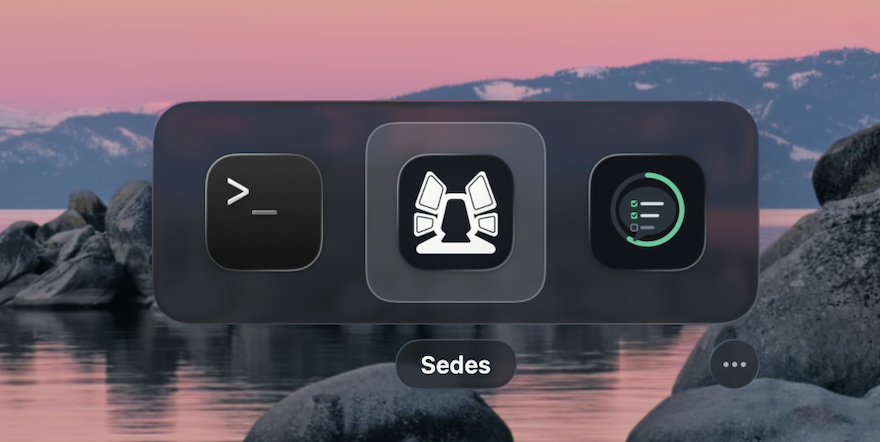
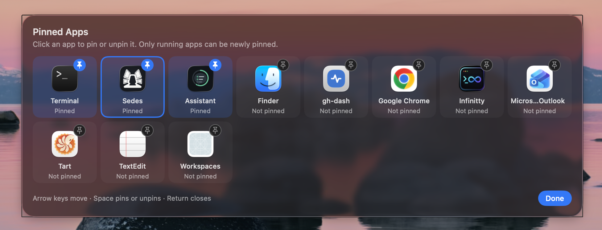

# PinTab

A ⌘Tab-style app switcher for macOS that shows only the apps you pin.

<p align="center">
  
</p>

<p align="center">
  
</p>

Most of the time you move between a handful of apps. PinTab keeps only those in the switcher, most recently used first, so a quick tap always takes you back to the last one.

- **Only your apps.** You choose which apps appear. A pinned app that isn't running is hidden, and comes back when it runs again.
- **Works like ⌘Tab.** Hold the modifier and tap the key to cycle, add ⇧ to go back, and release to switch. The panel shows real app icons in a compact Liquid Glass panel.
- **Your shortcut, or ⌘Tab itself.** Use a shortcut such as ⌥⌘Tab, which needs no special permissions. Or turn on ⌘Tab mode to replace the macOS switcher.
- **Small and private.** A menu-bar app with no network access, analytics or updater.

Requires macOS 14 or later. It was developed on macOS 26; earlier versions are untested.

## Install

### From the disk image

1. Open `PinTab-<version>-mac-arm64.dmg` and drag **PinTab** to **Applications**. The disk image is for Apple silicon; on an Intel Mac, build from source.
2. Open PinTab. It isn't notarized by Apple, so macOS blocks the first launch. Go to **System Settings › Privacy & Security** and click **Open Anyway** next to the PinTab message.
3. PinTab lives in the menu bar and has no Dock icon. On first launch it opens Settings.

### From source

You need Swift 6.2 or later. The Command Line Tools are enough; Xcode isn't required.

```sh
git clone https://github.com/kcosr/pintab.git
cd pintab
make install    # build, sign ad hoc, copy to ~/Applications and launch
```

## Getting started

1. In Settings, click **Record Shortcut** and press a combination such as ⌥⌘Tab. To use ⌘Tab itself, turn on **Use ⌘Tab** instead (see [⌘Tab mode](#tab-mode)).
2. Press the shortcut. Nothing is pinned yet, so the **Pinned Apps** editor opens. Click the running apps you want, then click **Done**.
3. Hold the modifier and tap the key.

To pin the app you're using, choose **Pin “‹app›”** from the menu-bar icon.

## Using the switcher

| While holding the modifier | Result |
| --- | --- |
| Tap the key | Next app, wrapping around |
| ⇧ + the key | Previous app |
| ← → | Move the selection |
| Point at an icon | Select it |
| Release the modifier | Switch to the selected app |
| Click an icon, or press Return | Switch immediately |
| Esc or `.` (period) | Cancel without switching |
| M, or click **⋯** | Open the pin editor |
| P, or click **⏸** | Pause PinTab and hand over to the macOS switcher |

- **Quick tap.** Pressing and releasing the shortcut quickly switches to your previous pinned app without showing the panel. Tap again to flip back.
- **Order.** Apps are listed most recently used first, starting from when PinTab launched. Starting from an app that isn't pinned, the first press selects your most recent pin.
- **⌥⌘ shortcuts.** Cancel with `.` rather than Esc, because macOS reserves ⌥⌘Esc for Force Quit.
- **What switching does.** Switching activates the app, like ⌘Tab. It doesn't reopen minimized windows, launch apps that aren't running, or change Spaces beyond what macOS does itself.
- **Where the panel appears.** On the display that has the pointer.
- **Pausing from the switcher.** Pausing closes the switcher without switching and stops PinTab listening for ⌘Tab and your shortcut. Keep holding ⌘ and press Tab again to get the macOS switcher. Choose **Resume PinTab** from the menu-bar icon to turn PinTab back on.

## Pinning apps

To open the pin editor, use any of these:
- press M or click **⋯** in the switcher;
- choose **Manage Pinned Apps…** from the menu-bar icon;
- use the button in Settings.

In the editor:
- **Pin or unpin an app** by clicking it, or by selecting it with the arrow keys and pressing Space. Changes are saved immediately.
- **Only running apps can be newly pinned.** There is no app browser, so open an app first to pin it.
- **Pinned apps that aren't running** stay pinned. They appear dimmed and can still be unpinned.
- **Close the editor** with Return, Esc, **Done** or a click outside it.

## ⌘Tab mode

macOS keeps ⌘Tab for its own switcher and never delivers it to ordinary app shortcuts. ⌘Tab mode uses an event tap to see ⌘Tab before the system switcher does. This is the same technique other third-party switchers use, and it needs Accessibility permission.

1. In Settings, turn on **Use ⌘Tab**.
2. When macOS asks, go to **System Settings › Privacy & Security › Accessibility** and turn on **PinTab**. ⌘Tab starts working as soon as it's allowed; there's no need to relaunch.

Good to know:

- **Your other shortcut keeps working.** A recorded shortcut such as ⌥⌘Tab needs no permission, so it still works even without Accessibility access.
- **Secure text entry.** macOS hides keystrokes from event taps in password fields and when Terminal's Secure Keyboard Entry is on. There, ⌘Tab shows the macOS switcher until you leave the field.
- **Getting the macOS switcher back.** It's replaced while ⌘Tab mode is on. To bring it back temporarily, press P or click **⏸** in the switcher, or choose **Pause PinTab** from the menu.
- **Each new version needs the permission again.** PinTab is signed ad hoc, so macOS treats every new build as a different app. If PinTab is listed as allowed but ⌘Tab opens the macOS switcher, select PinTab in the Accessibility list, remove it with **−**, then turn it on again.

## Menu bar and Settings

The menu-bar icon is dimmed when PinTab is paused or no shortcut is working. It offers:

- **Pin/Unpin “‹app›”** for the app you're using;
- **Manage Pinned Apps…**;
- **Settings…**: your shortcut, ⌘Tab mode, Pause and **Open at login**, which is off by default;
- **Pause PinTab** / **Resume PinTab**;
- **Quit PinTab**.

A recorded shortcut must follow these rules:
- It must include ⌘ or ⌃. Option-only shortcuts may not be delivered by macOS.
- It can't include ⇧, which is reserved for going backwards.
- It can't be a shortcut macOS already uses. Rejected examples include:
  - ⌘Tab, ⌘\`, ⌘Space, ⌘Q and ⌘W;
  - ⌘3 to ⌘5, because their ⇧ versions take screenshots;
  - anything enabled in **System Settings › Keyboard › Keyboard Shortcuts**;
  - anything another app has claimed.

## Privacy

- **Nothing leaves your Mac.** PinTab makes no network connections and has no analytics, crash reporting or updater.
- **What it stores:** your pinned apps (bundle identifiers and names), your shortcut, and whether ⌘Tab mode is on. These live in the `dev.local.PinTab` defaults domain.
- **Without ⌘Tab mode** it needs no special permissions. It registers one keyboard shortcut and can't see any other keystrokes.
- **With ⌘Tab mode** it acts only on ⌘Tab and on keys pressed while its switcher is open. It never records or logs typing.

## Troubleshooting

- **⌘Tab opens the macOS switcher.**
  - If the menu says "⌘Tab needs Accessibility permission", choose **Allow ⌘Tab in Accessibility Settings…** and turn PinTab on. After an update, remove PinTab from the list first, as described in [⌘Tab mode](#tab-mode).
  - It's expected while PinTab is paused and during secure text entry.
- **The shortcut does nothing.** The menu shows whether the shortcut is registered. If another app holds the combination, record a different one. Remote-desktop clients and keyboard remappers can also catch shortcuts before the Mac sees them.
- **Logs.** PinTab logs presses, switches and activation results; it never logs ordinary typing. To read them:

  ```sh
  /usr/bin/log show --last 10m --predicate 'subsystem == "dev.local.PinTab"'
  ```

## Uninstall

1. If **Open at login** is on, turn it off in Settings. Then quit PinTab from its menu.
2. Delete PinTab from Applications. If you installed from source, run `make uninstall`.
3. Optionally, remove the saved settings:

   ```sh
   defaults delete dev.local.PinTab
   ```

   If you used ⌘Tab mode, also remove PinTab from the Accessibility list.

## Development

| Command | What it does |
| --- | --- |
| `make install` | Build a release, sign it ad hoc, install to `~/Applications` and launch |
| `make test` | Run the PinTabCore test suite (Swift Testing) |
| `make app` | Build `build/PinTab.app` without installing |
| `make dmg` | Build `build/PinTab-<version>-mac-<arch>.dmg` |
| `make run` | Build and launch `build/PinTab.app` |
| `make logs` | Stream PinTab's log messages |
| `make icon` | Regenerate `Support/AppIcon.icns` |
| `make uninstall` | Quit PinTab and remove it from `~/Applications` |
| `make clean` | Remove build output |

- **Signing.** Builds are signed ad hoc with the fixed identifier `dev.local.PinTab`.
  - `make install` and `make run` clear PinTab's old Accessibility entry so macOS asks again.
  - To sign with a certificate instead, pass `SIGN_IDENTITY="Certificate Name"`; a self-signed code-signing certificate works. A stable signature keeps the Accessibility permission across builds.
- **Tests.** The suite covers the pure logic: the switcher state machine, ordering, shortcut rules, the ⌘Tab event filter and preferences parsing. With only the Command Line Tools installed, the Makefile adds the flags Swift Testing needs.
- **Previews.** To see the panels without pressing keys, run the command below. It shows the switcher or the editor for six seconds (nothing is activated), or opens Settings:

  ```sh
  open ~/Applications/PinTab.app --args -PinTabPreview switching   # or: managing, settings
  ```

```
Sources/PinTabCore/     Pure logic (Foundation only): state machine, ordering, shortcut rules, ⌘Tab event filter, preferences
Sources/PinTab/         The app: hotkeys, event tap, panel and views, activation, menu bar, Settings
Tests/PinTabCoreTests/  Swift Testing suite for PinTabCore
Support/                Info.plist template and app icon
scripts/                make-app.sh (bundle and sign), make-dmg.sh, make-icon.swift
assets/                 README screenshots
```

**How it works.**
- **State machine.** The interaction model is an explicit state machine (`SwitcherMachine`) with three states: idle, switching and managing. The app feeds it events and carries out the effects it returns: show, hide, activate and set pinned.
- **Input:**
  - The recorded shortcut is registered with the Carbon hotkey API.
  - ⌘Tab mode adds a session event tap. `CommandTabFilter` decides which keys the tap swallows.
  - A non-activating key panel receives Esc, the arrow keys and modifier changes without taking focus from the current app.
  - A 60 Hz modifier poll runs during a session as a safety net.
- **Activation.** Switching uses `NSRunningApplication` activation. If macOS doesn't honour the request, PinTab falls back to a cooperative hand-off.

## License

MIT. See [LICENSE](LICENSE).
